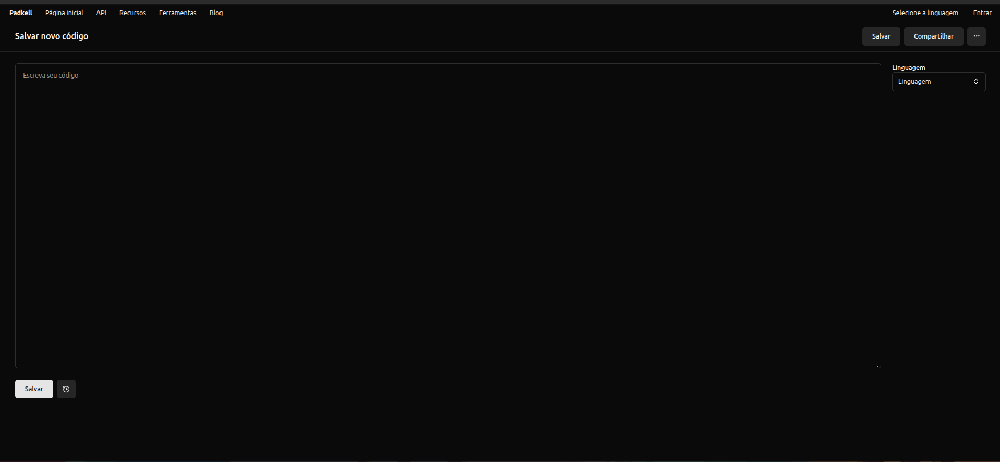
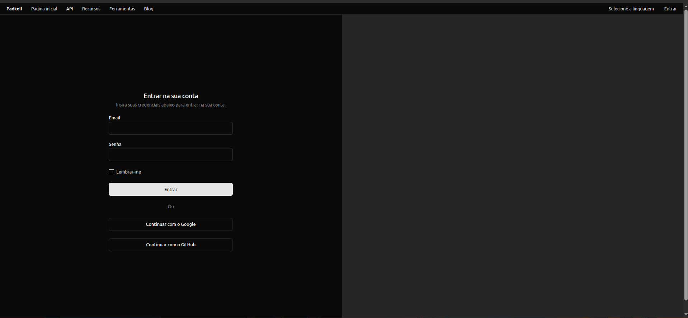
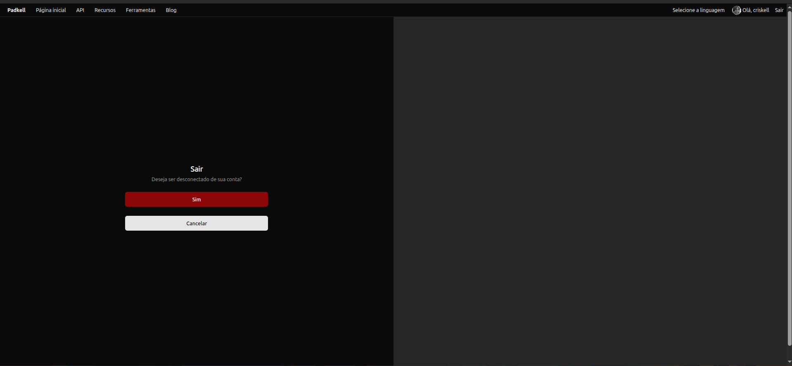
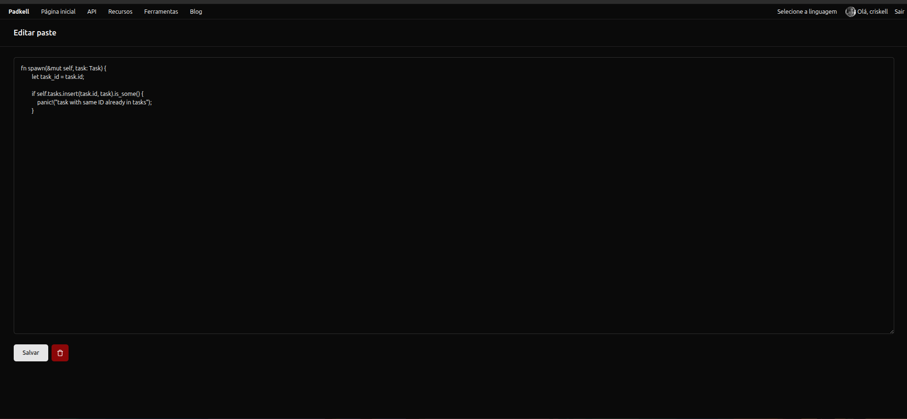
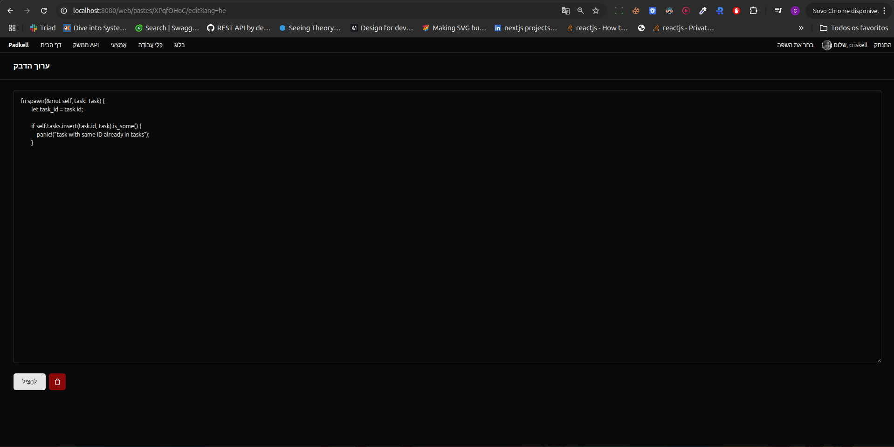

# padkell

Um aplicativo para compartilhar pastes, similar ao Pastebin. Projeto final feito para a disciplina de DS do curso técnico em Desenvolvimento de Sistemas pela ETEC Irmã Agostina, para fins educacionais.

## Tecnologias

- Java, Spring Boot
- Spring Security, OAuth2 com Google e GitHub
- Login com JWT
- Next.js
- Terraform
- AWS
- Docker
- Redis para consulta rápida da quantidade de visualizações de pastes
- Tensorflow para reconhecimento automático de linguagem

## O conceito

A aplicação serve como um site open-source moderno semelhante ao Pastebin, onde podemos compartilhar trechos (pastes/snippets) de código e compartilhar com os amigos, podendo servir como uma aplicação para deployment selfhosted.

## Componentes

Temos dois front-ends para esse projeto, feitos com objetivos diferentes.

O front-end da pasta `frontend` é feito com Next.js 15, Server Components, HeroUI, next-safe-action. Foi feito com o objetivo de ser o frontend final da aplicação.

O front-end na pasta `backend/src/main/resources/templates` foi feito com o objetivo de aprender e praticar Thymeleaf, autenticação e internacionalização.

Ambos os frontends consomem um mesmo backend na pasta `backend`, feito com Spring Boot e arquitetura em camadas.

## Imagens

### Front-end embutido com Thymeleaf

#### Página inicial


#### Login


#### Sair


#### Editar paste


#### Editar paste (página em hebraico)


## Arquitetura de software

O backend foi pensando feito numa arquitetura em camadas com:

- Camada de Aplicação
- Camada de Domínio
- Camada de Infraestrutura

A camada de aplicação se concentra na orquestração da lógica de negócio, o domínio na definição de entidades e invariantes e a camada de infraestrutura na coleta de requisições do mundo externo.

A camada de aplicação é representada pelos serviços, a camada de domínio pelas entidades e a camada de infraestrutura pelos controladores. DTOs são blocos de dados que são passados ​​de uma camada para outra.

## Deployment

A implantação foi feita na AWS utilizando Terraform como ferramenta de IaC e Docker para criação de ambientes reproduzíveis.

## Como executar

Tenha Docker, Java, Node.js e pnpm instalados.

### Banco de dados

Utilizamos Docker para rodar containers do Redis e MySQL localmente.

Para subir os containers:

```
cd infra
docker compose up -d
```

### Backend

Para rodar o backend, primeiro copie `backend/.env.example` para `backend/.env` e preencha as credenciais.

Logo depois:

```
cd backend
mvn spring-boot:run
```

É necessário executar o backend tendo o diretório de trabalho atual como `backend/`, caso contrário as variáveis de ambiente do arquivo `.env` não serão carregadas.

### Frontend

Para rodar o frontend Next.js:

```
cd frontend
pnpm install
pnpm run dev
```